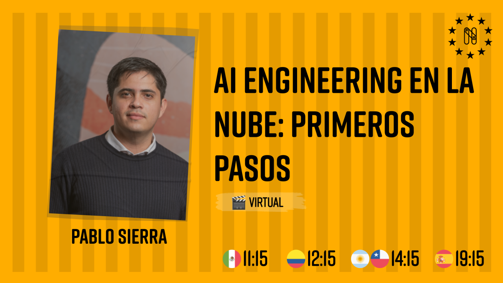

# AI Engineering en la Nube Primeros Pasos

Esta guía te llevará a través del proceso de desarrollo y despliegue en [Oracle Cloud Infrastructure (OCI)](https://www.oracle.com/ar/cloud/) para construir tu primera aplicacion en la que útlices modelos fundacionales como `LLAMA 3.1`, prompt engineering, rag y usando principalmente `la capa gratuita de OCI`.

> Ingresa a tu cuenta en la nube o si lo necesitas puedes crear una cuenta en la nube en el link `https://www.oracle.com/ar/cloud/free/` y puedes guiarte en el proceso con el tutorial de Youtube [Crear Cuenta Gratuita de Oracle Cloud](https://www.youtube.com/watch?v=AZAb5hm1xbQ), y con ellos podamos usar 300$ en créditos universales más el [
Oracle Cloud (modo gratuito)](https://www.oracle.com/es/cloud/free/). En la region de Chicago, Sao Paulo, London o Frankfurt.


## 1. Configuración del Entorno de Desarrollo

**Tiempo estimado**: 5 minutos

## Objetivos

- Configurar Visual Studio Code para desarrollo remoto
- Generar una clave ssh usando Powershell

---

### Instalar Visual Studio Code

1. Descarga e instala [Visual Studio Code](https://code.visualstudio.com/).
2. Abre Visual Studio Code, busca e instala la extensión **Remote - SSH** en el [marketplace de extensiones](https://code.visualstudio.com/docs/remote/ssh).
4. Busca e instala la extensión **Python** en el [marketplace de extensiones](https://marketplace.visualstudio.com/items?itemName=ms-python.python).

---

### Generar una clave SSH usando PowerShell

Para conectarte a las máquinas virtuales en la nube de forma segura usando Visual Studio Code, necesitas generar una clave SSH. Aquí te muestro cómo hacerlo:

### Paso 1: Abrir PowerShell

1. Presiona `Win + X` y selecciona **Windows PowerShell** o **Windows Terminal**.
2. Navega a tu carpeta principal (por defecto es `C:\Users\TuNombreDeUsuario`).

### Paso 2: Generar el par de llaves SSH

Ejecuta el siguiente comando en PowerShell para generar tu clave SSH:

```powershell
ssh-keygen -t rsa -b 4096
```

Presiona Enter para aceptar la ubicación predeterminada 

```C:\Users\TuNombreDeUsuario\.ssh\id_rsa```

### Paso 3: Verificar la generación de las llaves
Se crearán dos archivos en ~/.ssh/:

- id_rsa: Tu clave privada (guárdala de forma segura).
- id_rsa.pub: Tu clave pública (compártela para autenticarte en servidores).


# Desplegar una VM en OCI con Ubuntu 22.04 Minimal (aarch64), una Base de Datos Autónoma 23c AI y una VCN

Este tutorial te guiará para crear y configurar una instancia de VM Ubuntu 22.04 Minimal en OCI utilizando la capa gratuita, además de configurar una Base de Datos Autónoma 23c AI y una red virtual (VCN).

## Prerrequisitos

1. Tener una cuenta en Oracle Cloud con acceso a la capa gratuita.
2. Acceder al [Panel de Control de OCI](https://cloud.oracle.com).

---

## Paso 1: Crear una Red Virtual (VCN)

1. En el panel de OCI, navega a **Redes** > **Redes Virtuales en la Nube (VCN)**.
2. Haz clic en **Crear VCN**.
3. Asigna un nombre a la VCN (por ejemplo, `vcn-free-tier`).
4. Selecciona la opción de **VCN con Internet Gateway y subred pública**.
5. Revisa la configuración y haz clic en **Crear**.

---

## Paso 2: Crear una VM Ubuntu 22.04 Minimal (aarch64)

1. Navega a **Instancias de cómputo** en el menú de OCI.
2. Haz clic en **Crear Instancia**.
3. Asigna un nombre a la instancia (por ejemplo, `vm-ubuntu-22-04-minimal`).
4. Selecciona la **forma** como `VM.Standard.A1.Flex` (compatible con la arquitectura aarch64 y disponible en la capa gratuita).
5. En la sección **Imagen del sistema operativo**, selecciona **Ubuntu 22.04 Minimal (aarch64)**.
6. Configura la cantidad de OCPUs (1 OCPU) y la memoria (mínimo 1 GB).
7. Asegúrate de que la instancia esté conectada a la VCN creada previamente y selecciona la **subred pública**.
9. Asegurate de cargar como opción la clave `id_rsa.pub``que creaste previamente.
8. Haz clic en **Crear** para lanzar la VM.

---

## Paso 3: Configurar una Base de Datos Autónoma 23c AI

1. Navega a **Bases de Datos** > **Base de Datos Autónoma** en el menú de OCI.
2. Haz clic en **Crear Base de Datos Autónoma**.
3. Asigna un nombre a la base de datos (por ejemplo, `adb-23c-ai`).
4. Selecciona el tipo de **Base de Datos Transaccional**.
5. En la sección de versión, selecciona **Oracle Database 23c AI**.
6. Selecciona la **VCN** que creaste en el paso 1 para conectividad.
7. Completa los detalles adicionales de configuración, como el nombre de usuario, contraseña y el tamaño de almacenamiento (los valores por defecto están optimizados para la capa gratuita).
8. Haz clic en **Crear Base de Datos**.

---


# 1. Obtener la Clave Pública y Configurar la VM
Antes de conectarte, asegúrate de que la clave pública (generada como id_rsa.pub) esté configurada en la VM:

* Accede a tu VM: Usa el panel de control de tu proveedor de nube para acceder a tu máquina virtual o a la interfaz de administración de la red.

Añadir la clave pública a la VM:

Conéctate a tu VM usando un cliente SSH.
Abre el archivo ~/.ssh/authorized_keys en la VM (si no existe, créalo).
Copia el contenido de tu archivo id_rsa.pub y pégalo en el archivo authorized_keys en la VM.
Guarda y cierra el archivo.

# 2. Configurar Visual Studio Code para Conexión Remota

Abrir VS Code: Inicia Visual Studio Code en tu computadora.

Configurar la Extensión Remote - SSH:

- Abre el panel de extensiones en VS Code (Ctrl+Shift+X o Cmd+Shift+X en macOS).
- Busca e instala la extensión Remote - SSH si aún no lo has hecho.

Configurar la Conexión SSH:

Abre la paleta de comandos (Ctrl+Shift+P o Cmd+Shift+P en macOS).
Escribe Remote-SSH: Add New SSH Host... y selecciona esta opción.
Se te pedirá que ingreses la dirección del host en el formato usuario@direccion_ip, por ejemplo, ubuntu@123.45.67.89.
Selecciona el archivo de configuración SSH donde deseas guardar la configuración (por defecto ~/.ssh/config).
Ejemplo de configuración en ~/.ssh/config:

Host mi-vm
    HostName 123.45.67.89
    User ubuntu
    IdentityFile C:\Users\TuNombreDeUsuario\.ssh\id_rsa
Asegúrate de reemplazar 123.45.67.89 con la IP pública de tu VM y ubuntu con el nombre de usuario adecuado.

Conectar a la VM:

Abre la paleta de comandos (Ctrl+Shift+P o Cmd+Shift+P en macOS).
Escribe Remote-SSH: Connect to Host... y selecciona el host que configuraste (mi-vm o el nombre que elegiste).
VS Code intentará conectarse a tu VM. Si es la primera vez que te conectas, es posible que se te pida que confirmes la autenticidad del host.
Abrir la Carpeta de Proyecto en la VM:

Una vez conectado, puedes abrir una carpeta en la VM desde el menú Archivo > Abrir Carpeta....
Navega a la carpeta de tu proyecto o a la ubicación donde deseas trabajar.


# Paso 3: Instalar las dependencias previas
Antes de comenzar, asegúrate de actualizar los repositorios e instalar algunas librerías necesarias:

```bash
sudo apt update
sudo apt install -y git python3-pip
```

### 2. Verificar que pip esté instalado correctamente
Confirma la instalación de pip ejecutando:

```
bash
pip3 --version
```

3. Instalar las librerías necesarias
Ahora puedes instalar las dependencias con pip3:

```bash
pip3 install oracledb sentence-transformers oci
```


# Conectarse a la base de datos oracle

Quick Start: Developing Python Applications for Oracle Autonomous Database
https://www.oracle.com/database/technologies/appdev/python/quickstartpython.html


[Accessing OCI Object Storage using Instance Principals](https://medium.com/@deepalimittal23/accessing-oci-object-storage-using-instance-principals-203ac93cb77)

Lista de verificación para configurar Instance Principals en OCI

 Crear una instancia de cómputo en OCI
 Crear un Dynamic Group

 Ir a Identity & Security > Dynamic Groups
 Crear nuevo Dynamic Group
 Definir regla: ANY {instance.compartment.id = 'OCID_del_compartimento'}


 Crear una política

 Ir a Identity & Security > Policies
 Crear nueva política en el compartimento raíz
 Añadir declaraciones:
CopyAllow dynamic-group [Nombre-del-Dynamic-Group] to use generative-ai-family in compartment [Nombre-del-compartimento]
Allow dynamic-group [Nombre-del-Dynamic-Group] to use ai-service-family in compartment [Nombre-del-compartimento]


 Configurar el Virtual Cloud Network (VCN)

 Verificar ruta de salida a Internet (Internet Gateway o NAT Gateway)
 Configurar reglas de seguridad para permitir tráfico saliente al endpoint de Generative AI


 Instalar el SDK de OCI en la instancia

 Ejecutar: pip install oci


 Verificar permisos de la instancia para leer su propi


 # Referencias

 https://apexapps.oracle.com/pls/apex/r/dbpm/livelabs/run-workshop?p210_wid=3939&p210_wec=&session=115486261083319
https://medium.com/@deepalimittal23/accessing-oci-object-storage-using-instance-principals-203ac93cb77
https://www.llama.com/docs/model-cards-and-prompt-formats/llama3_1/

# Extensions en Visual studio Code
better-python-string-sql

# Como desplegar
```bash
streamlit run app.py
````

REFERENCIAS - https://apexapps.oracle.com/pls/apex/r/dbpm/livelabs/run-workshop?p210_wid=3939&p210_wec=&session=115486261083319 AI Chatbot engine with Oracle Database 23ai and OCI Generative AI Services
